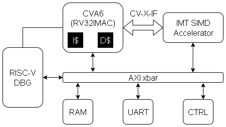

# Matrix Accelerator Demonstrator



Components:
* [CVA6 RISC-V Core](https://github.com/openhwgroup/cva6)
* [Matrix Accelerator](https://github.com/alex2kameboss/MatrixAccelerator)
* [RISC-V DBG](https://github.com/alex2kameboss/MatrixAccelerator)
* [CV-X-IF](https://github.com/openhwgroup/core-v-xif)
* [AXI Crossbar](https://github.com/pulp-platform/axi)

## Software

1. [Bender](https://github.com/pulp-platform/bender)
1. QuestaSim or VCS
1. Vivado >= 2024.1

## First steps

1. Download Bender submodules
1. Build RISC-V custom toolchain (*make gcc*)
1. Build Openocd (*make openocd*)

### Example

```bash
bender update
make gcc
make openocd
```

## Usage

Extra Bender arguments with **DEFINES** variable.

Project arguments, configure with defines:

* PRF_LOG_P (default 1) - log2 number of internal memory banks, rows
* PRF_LOG_Q (default 2) - log2 number of internal memory banks, columns

```
make <target> DEFINES="-D PRF_LOG_P=1 -D PRF_LOG_Q=1"
```

### RTL simulation

```bash
make sim # for modelsim
```

### Vivado run

```bash
make vivado # outputs in runs/run_<date> directory
```

### Examples

More examples available in sh files: *demo_batch.sh*, *syn_batch.sh* and *speed-up.sh*

## Project structure

- **src** - all project sources
    - **rtl** - all synthetizable source code
    - **tests** - all test sources (non-synthetizable)
    - **includes** - *svh* files
    - **interfaces** - project interface definitions
    - **ips** - directory for all submodules, bender will download here all dependencies 
    - **packages** - project packages definitions
- **runs** - vivado and simulation running directory
- **scripts** - multiple script for various tools
- **apps** - C source files
- **toolchain** - GCC and openocd folder